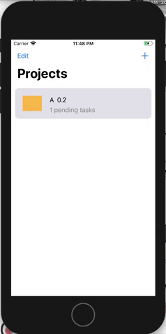
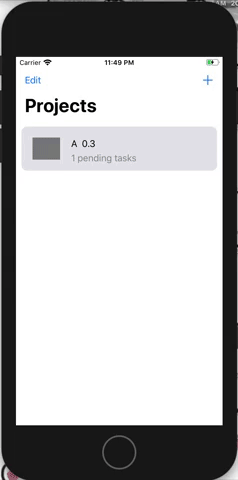
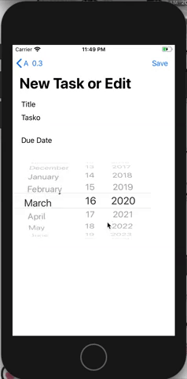

# Taskee2
Make School | MOB 2-2 | Core Data final Project

Final Project of the MOB 2.1 - Local Persistence in iOS class

#### Taskee: An app to keep track of Projects and the tasks needed to complete them. A simple interface that anyone can use.

### Task: Develop an app using Core Data that allows for the creation, updating, and deletion of Projects with tasks

Each Project should have a list of tasks to-do and a list of tasks done, as well as the ability to add tasks.

Download project [here](https://github.com/KitsuneNoctus/Taskee2/archive/master.zip)

## Project Interaction

## Task Interaction

##### Languages:
- Swift

##### Persistence Methods:
- CoreData

#### Code Base Interaction
- Controllers: [here](https://github.com/KitsuneNoctus/Taskee2/tree/master/Taskee2/Controllers) - Where the body of the code is. Creation of View Controllers and Cells. Holds the core of data interaction
- CoreData: [here](https://github.com/KitsuneNoctus/Taskee2/tree/master/Taskee2/CoreData) - Hold the Core Data Stack class. What makes the whole project work.
- Model: [here](https://github.com/KitsuneNoctus/Taskee2/tree/master/Taskee2/Model) - Contains the Data Model and the Entity classes. Also holds the custom text field

Original Taskee [Here](https://github.com/KitsuneNoctus/Taskee-Final)
> Lost do to technical and human error
